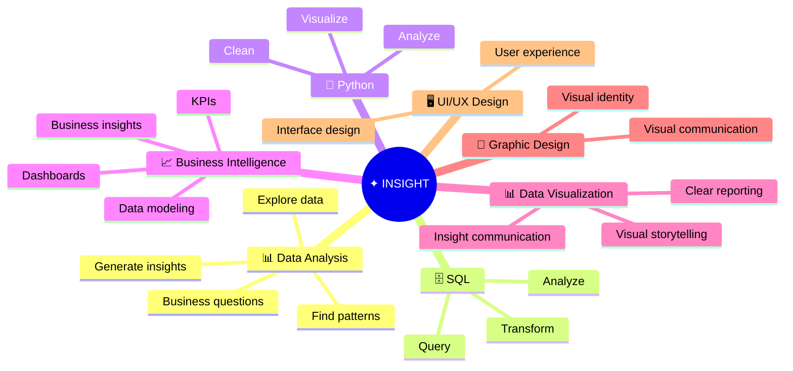

 

 

<table>
<tr>
<td align="center" width="33%">

### 📊 Data Analyst

Turning raw data into clear insights, dashboards, and business stories.

</td>
<td align="center" width="33%">

### 📈 Business Intelligence

Building KPI-driven dashboards that support better business decisions.

</td>
<td align="center" width="33%">

### 🎨 Data Visualization & Design

Combining analytical thinking with visual design to communicate insights clearly.

</td>
</tr>
</table>

 

> *I turn raw data into clear insights,*
> *and clear insights into visual stories that make an impact.*

I'm a **Data Analyst** with a focus on **Business Intelligence, Data Analysis, and Data Visualization**. I enjoy transforming raw and complex data into meaningful insights, interactive dashboards, and clear business stories that support better decisions.

My background in **Graphic Design and UI/UX** gives me an additional perspective on how data and insights are presented — making dashboards not only informative, but also clear, intuitive, and visually engaging.

`DATA` × `ANALYSIS` × `VISUALIZATION` × `DESIGN`

**Core Focus:** `Data Analysis` · `Business Intelligence` · `Data Visualization`

```mermaid
flowchart LR
    A([✦ Business Question]) --> B([✦ Raw Data])
    B --> C[🧹 Clean]
    C --> D[🔍 Explore]
    D --> E[📐 Analyze]
    E --> F[📊 Visualize]
    F --> G([✦ Insight])
    G --> H([🚀 Decision])

    style A fill:#C7A9D0,stroke:#fff,color:#1a1325
    style B fill:#2b2139,stroke:#C7A9D0,color:#fff
    style C fill:#2b2139,stroke:#C7A9D0,color:#fff
    style D fill:#2b2139,stroke:#C7A9D0,color:#fff
    style E fill:#2b2139,stroke:#C7A9D0,color:#fff
    style F fill:#2b2139,stroke:#C7A9D0,color:#fff
    style G fill:#C7A9D0,stroke:#fff,color:#1a1325
    style H fill:#8e6fb0,stroke:#fff,color:#fff
```

 

### `DATA` → `STORY` → `IMPACT`

 

**📊 Data & Business Intelligence**

**🐍 Python Data Stack**

**🎨 Design & UI/UX**

**⚙️ Workflow**

  

<table>
<tr>
<td width="50%" valign="top" align="center">

**🐍 Hotel Booking Demand Analysis** 
*Why do guests cancel, and when do they book?* 
Booking patterns, cancellations, pricing, and customer behavior. 
`Python` `Pandas` `NumPy` `Matplotlib` `Seaborn`

</td>
<td width="50%" valign="top" align="center">

**🗄️ Hotel Management Database & Analytics** 
*From schema to dashboard.* 
Database design, normalization, SQL analysis, programmability, performance optimization, and Power BI integration. 
`SQL Server` `T-SQL` `Power BI`

</td>
</tr>
</table>

 

My GitHub contains selected projects with code and technical documentation. 
My broader portfolio includes dashboard, BI, data visualization, and design projects.

<table>
<tr>
<td align="center" width="25%">

### 📊

**Power BI**

Dashboards, KPIs, data modeling, and business insights.

</td>

<td align="center" width="25%">

### 📗

**Excel**

Data analysis, Power Query, Power Pivot, and interactive dashboards.

</td>

<td align="center" width="25%">

### 📈

**Tableau**

Interactive dashboards and visual data storytelling.

</td>

<td align="center" width="25%">

### 🎨

**UI/UX**

Interface design, visual systems, and user-centered experiences.

</td>
</tr>
</table>

 

  

 

 

 

🔭 Building BI dashboards that tell one clear story 
🌱 Exploring advanced DAX, BI storytelling, and data visualization 
🎯 Open to Data Analyst & BI opportunities 
💬 Ask me about: data analysis, data visualization, SQL, or dashboard design

 

**Analyze the data. Understand the story. Design the insight.**

