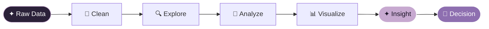

### ✦ ولاء عبدالقادر أحمد  |  WALAA ABDELKADER AHMED ✦

 

---

## ✦ ABOUT ME

> *I turn raw data into clear insights,*
> *and clear insights into visuals people remember.*

I'm a **Data Analyst & Business Intelligence enthusiast** with a creative design background. I enjoy turning messy data into meaningful visualizations and practical business stories.

`DATA` × `ANALYSIS` × `VISUALIZATION` × `DESIGN`

**Languages I work in:** `Python` · `SQL`

---

## ✦ TOOLKIT

**📊 Data & Business Intelligence**

**🐍 Python Data Stack**

**🎨 Design & UI/UX**

**⚙️ Workflow**

---

## ✦ MY DATA JOURNEY

### `DATA` → `STORY` → `IMPACT`

---

## ✦ FEATURED PROJECTS

<table>
<tr>
<td width="50%" valign="top">

### 🐍 Hotel Booking Demand Analysis

*Why do guests cancel, and when do they book?*

Explores booking patterns, cancellations, pricing, and customer behavior to surface what drives demand.

`Python` `Pandas` `NumPy` `Matplotlib` `Seaborn`

**[→ View Repository](https://github.com/walaa-abdelkader/Hotel-Booking-Demand-Analysis-py)**

</td>
<td width="50%" valign="top">

### 🗄️ Hotel Management Database & Analytics

*From schema to dashboard.*

Covers database design, normalization, SQL analysis, programmability, performance optimization, and Power BI integration.

`SQL Server` `T-SQL` `Database Design` `Power BI`

**[→ View Repository](https://github.com/walaa-abdelkader/Hotel-Management-SQL)**

</td>
</tr>
</table>

---

## ✦ WHAT I DO

| | Skill | What it looks like |
|:-:|:--|:--|
| 📊 | **Data Analysis** | Explore data · find patterns · generate insights |
| 🗄️ | **SQL** | Query · transform · analyze |
| 🐍 | **Python** | Clean · analyze · visualize |
| 📈 | **Business Intelligence** | Dashboards · KPIs · business insights |
| 🎨 | **Creative Design** | Graphic design · UI/UX · visual communication |

---

## ✦ GITHUB PULSE

---

## ✦ CURRENTLY

- 🔭 Building BI dashboards that tell one clear story
- 🌱 Going deeper into DAX, advanced SQL, and storytelling with data
- 🎯 Open to data analyst and BI opportunities
- 💬 Ask me about: data visualization, SQL, or making dashboards beautiful

---

### `WHERE DATA MEETS CREATIVITY`

**Analyze the data.**
**Understand the story.**
**Design the insight.**

✦ ✦ ✦

